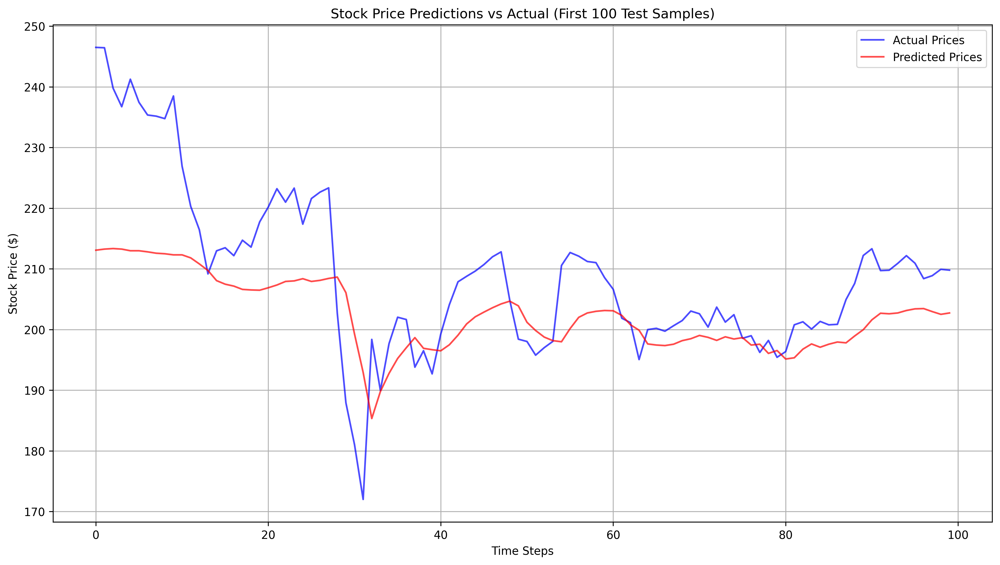

# Stock Price Prediction using RNNs

This project implements a **Recurrent Neural Network (RNN)** to predict stock prices using historical data and technical indicators. The goal is to model sequential patterns in stock prices and forecast future values. 

---

## 📊 Project Overview

We are using historical stock data of 5 major companies:

- Apple (AAPL)
- Amazon (AMZN)
- Google (GOOGL)
- Microsoft (MSFT)
- Tesla (TSLA)

The RNN is trained on sequences of past stock prices and technical indicators to predict future stock prices. The model uses **PyTorch** and incorporates early stopping, learning rate scheduling, and standardization via scalers.

---


**Example of raw data columns:**

| Date       | Open | High | Low | Close | Volume |
|------------|------|------|-----|-------|--------|
| 2024-01-02 | ...  | ...  | ... | ...   | ...    |

---

## ⚙️ Project Workflow

1. **Data Download and Cleaning**  
   - Downloaded using `yfinance`.
   - Flattened MultiIndex columns.
   - Converted all numeric columns to `float`.
   - Added technical indicators (e.g., moving averages, RSI).

2. **Data Preprocessing**  
   - Train/validation/test splits:
     - Train: 70%
     - Validation: 15%
     - Test: 15%
   - Standardized numeric features using `MinMaxScaler`.

3. **Sequence Creation**  
   - Sliding window sequences are created for RNN input.
   - Train/val/test sets converted into sequences of length `N` for model input.

4. **Model Architecture**  
   - RNN with hidden layers and fully connected output.
   - Loss function: **MSELoss**
   - Optimizer: **Adam**
   - Early stopping based on validation loss.

5. **Training**  
   - Epochs: up to 100  
   - Early stopping triggered at epoch 43  
   - Learning rate scheduling applied  

**Example log snippet:**


6. **Evaluation Metrics**  
   - Mean Squared Error (MSE): 201.9271  
   - Root Mean Squared Error (RMSE): 14.2101  
   - Mean Absolute Error (MAE): 10.5960  
   - Mean Absolute Percentage Error (MAPE): 4.83%  
   - R-squared Score: 0.7124  

**Prediction vs Actual Sample (first 100 test samples):**



---

## 💻 How to Run

1. Clone this repo:
```bash
git clone <repo-url>
cd stock-price-rnn

